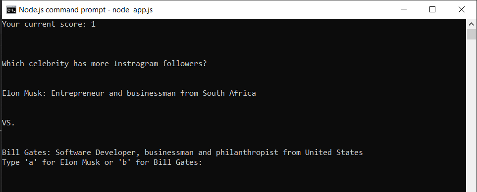
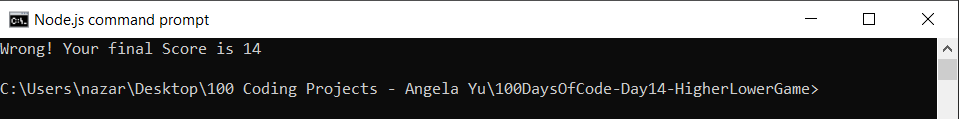

# 100 Days of Code - Day 14 - Higher Lower Game

# Prompt

Write a program that has the following console features:

* Present the user with 2 options
* The user must guess which of the 2 options has more instagram followers.
* if the user is correct, they will get a point.
* keep the game going until the user gets it wrong.
* then end the game, telling the user their final score.
* you must use a data object with the following properties:
    * name, follower_count, description, and country
* you must have at least 15 options
* the options will be selected at random

# Example

Compare A: Neymar, a Footballer from Brasil.

VS.

Compare B: Khloe Kardashian, a reality TV personality and business woman from the United States.

Type 'A' or 'B': B

Your final score is 0

# Screenshot of Working Solution

